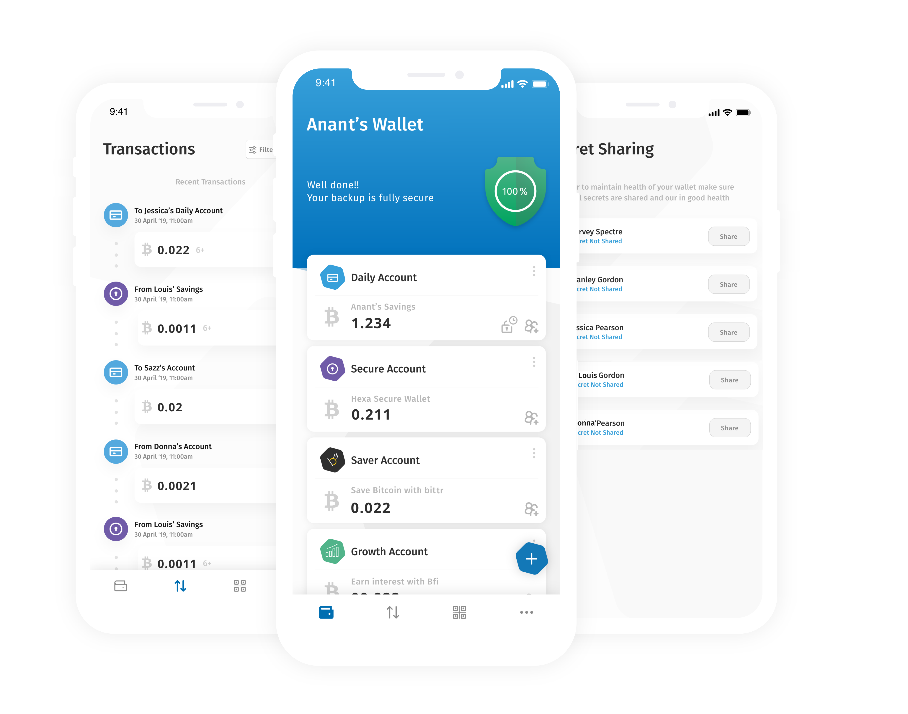

# Hexa Wallet

Hexa Wallet is a user friendly mobile bitcoin wallet that enables p2p commerce.


   
There are various types of accounts that are supported in the Hexa Wallet:

1. Savings Account: A savings account is a standard bitcoin wallet optimal for daily use
2. Secure Account: A secure account is a bitcoin wallet secured by 2FA optimal for storing larger amounts of bitcoin  
   
Hexa requires a pin to unlock and access funds and Accounts are protected by a seed restoration feature which can be used to import wallets from other devices or from an older version of Hexa.

### Design Considerations

The various design considerations that Hexa chose to undertake are over at [the wiki](https://github.com/thecryptobee/Hexa-Wallet/wiki/Design-Considerations)

### Developing locally

#### Prerequisites:
- [Node](https://nodejs.org/en/)
- [yarn](https://www.npmjs.com/package/yarn)
- [React-Native](https://www.npmjs.com/package/react-native)] + [rn-nodeify](https://www.npmjs.com/package/rn-nodeify)
- [Xcode](https://developer.apple.com/xcode/)
- iOS Simulator on Xcode

#### Installing hexa
```
git clone https://github.com/bithyve/hexa.git
cd hexa
sudo yarn install
chmod +x pkgchanges/setup.sh
./pkgchanges/setup.sh
```

Make sure you have a `.env.dev` similar to `.env.example` in your project's root directory before running hexa. If this file is absent, you will be faced with a red screen on the iOS Simulator.

#### Running hexa android
```
npm run android-dev
```
     
#### Running hexa ios    
            
```
cd ios
rm -rf Pods
rm -rf build   
rm Podfile.lock 
rm -rf ~Library/{yourusername}/Xcode/DerivedData
pod install      
Double click on 
HexaWallet.xcworkspace   
open project xcode 

Step 1:
Delete this lib (react-native-config)
```      
   

```   
Step 2:
Search react-native-config and remove 6 pod file inside
"${PODS_ROOT}/Headers/Public/react-native-config" and -l"react-native-config"
```  
   

```     
Step 3:
Remove All Fonts in  HexaWallet => Resources
then drag and drop all font your project like 
```   
  
 
```   
Step 4:
Click on (Add to target)
```   
   
        
            

### Contributing
Please feel free to open a pull requests and issues with bugfixes and suggestions.
  
### License  
[LICENSE](LICENSE)
